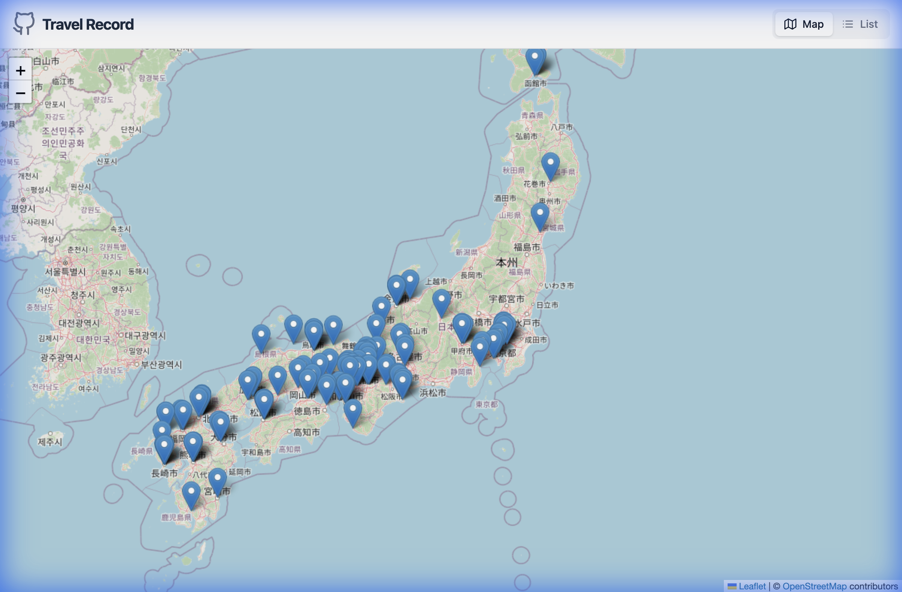
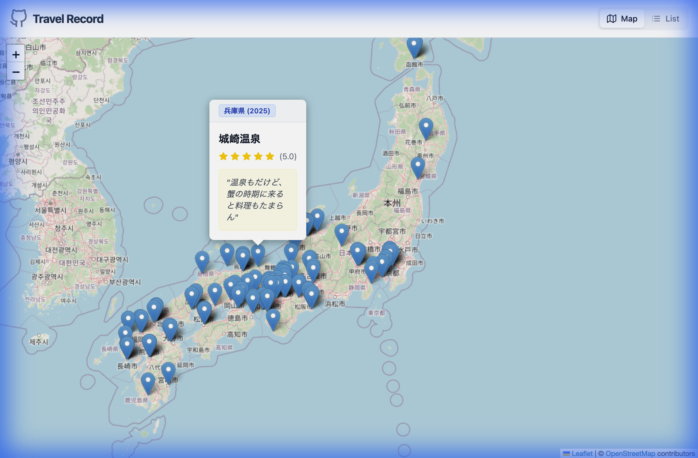
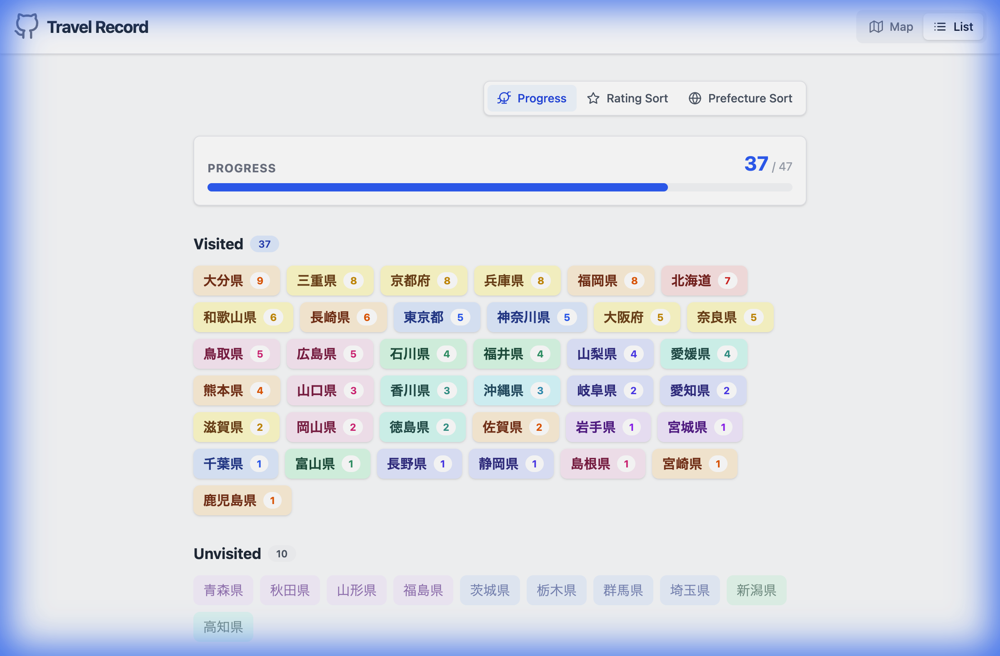
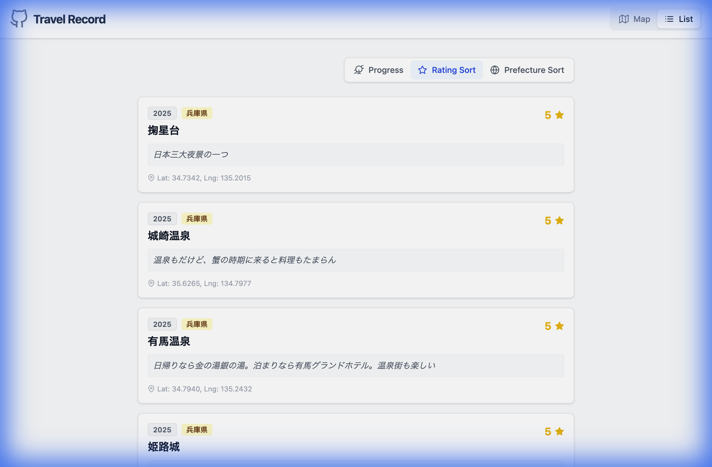
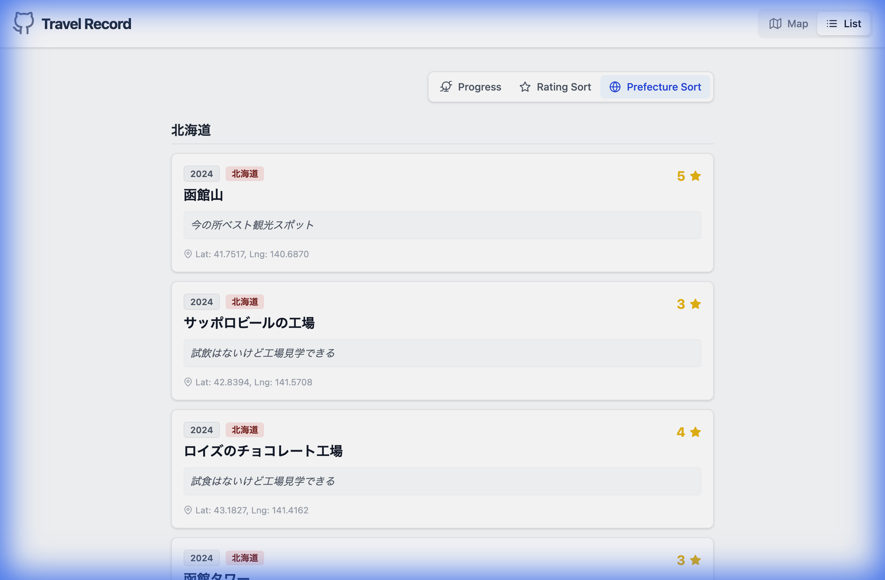

# Travel Record

自分だけの旅行記録を地図上にマッピングし、思い出を管理できるWebアプリケーションです。
訪れた場所を日本地図上にピン留めしたり、都道府県別の訪問達成率を確認したりすることができます。

このプロジェクトをForkして、あなたの旅行記録を作成・公開してみてください！

## ✨ 特徴

- **Map View**: 日本地図上に訪問先をピン表示。クリックで詳細を確認できます。
- **List View**: 訪問先をリスト形式で閲覧。評価順や都道府県順で並び替えが可能。
- **Progress**: 都道府県ごとの訪問達成状況を可視化。全47都道府県制覇を目指しましょう！

## 🚀 使い方

### 1. リポジトリをForkする

まず、GitHub上でこのリポジトリを自分のアカウントにForkしてください。

### 2. ローカルにCloneする

Forkしたリポジトリをローカル環境にCloneします。

```bash
git clone https://github.com/YOUR_USERNAME/travel-record.git
cd travel-record
```

### 3. 依存パッケージのインストール

```bash
npm install
```

### 4. 開発サーバーの起動

```bash
npm run dev
```
ブラウザで `http://localhost:5173` (ポートは環境により異なる場合があります) を開き、動作を確認してください。

## 📝 データの編集

自分の旅行記録に入れ替えるには、以下のファイルを編集します。

### 旅行データの更新 (`src/data.ts`)

`src/data.ts` ファイルにある `travelRecords` 配列を書き換えてください。

```typescript
export const travelRecords: TravelRecord[] = [
    {
        year: 2024,
        prefecture: "北海道",
        name: "函館山",
        coords: [41.7516585, 140.6869788], // [緯度, 経度]
        rating: 5, // 1~5の5段階評価
        memo: "夜景が綺麗だった！",
    },
    // ... 他のデータを追加
];
```

※ 緯度・経度はGoogle Maps等で場所を右クリックすると簡単に取得できます。

### タイトルの変更 (`index.html`)

`index.html` の `<title>` タグを自分の名前に変更しましょう。

```html
<title>My Travel Record</title>
```

## 🌍 デプロイ

このアプリケーションは静的なWebサイトとしてビルドされます。GitHub Pages, Cloudflare Pages, Vercel, Netlify など、お好きなホスティングサービスに無料でデプロイ可能です。

### ビルドコマンド

```bash
npm run build
```

`dist` ディレクトリに公開用のファイルが生成されます。

## 🖥️ Screen Specification

### 1. Map View (Default)
The initial view of the application, displaying travel records as markers on a map of Japan.



#### Features
- Interactive map powered by Leaflet.
- Markers indicating locations of travel records.
- Zoom and pan functionality.
- Header with links to GitHub ([Travel Record Repo](https://github.com/ysknsid25/travel-record)) and toggle between Map and List views.

### 2. Map View - Popup Details
Clicking on a marker opens a popup displaying the details of the travel record.



#### Details Displayed
- Prefecture and Year.
- Location/Spot Name.
- Star Rating (1-5 stars).
- Memo/Description.
- Navigation arrows (if multiple records exist at the same location).

### 3. List View - Progress Tab (Default)
Displays the user's progress in visiting all 47 prefectures.



#### Features
- Progress bar showing visited count / 47.
- List of "Visited" prefectures with visit counts, color-coded by region.
- List of "Unvisited" prefectures.

### 4. List View - Rating Sort
Displays travel records sorted by their star rating (descending).



#### Features
- List of individual travel records.
- Sorted by highest rating first.
- Displays Year, Prefecture, Name, Rating, and Memo.

### 5. List View - Prefecture Sort
Displays travel records grouped by prefecture, ordered from North to South.



#### Features
- Headers for each prefecture.
- Records listed under their respective prefecture.
- Standard record details displayed for each item.
